{ style="max-width:100%" }

<table style="width:93%;">
<colgroup>
<col style="width: 93%" />
</colgroup>
<tbody>
<tr>
<td style="text-align: center;">
<strong>Teamora</strong>

<em>People. Potential. Progress.</em>

Module 1 &amp; 2 — Technical Design Document
</td>
</tr>
<tr>
<td style="text-align: center;"></td>
</tr>
</tbody>
</table>

**TECHNICAL DESIGN (HLD/LLD)**

**PROJECT CODE: PHN-HR-2026-01-TDD-M1M2**

September 2026

Submitted by: Phoneme Solutions Pvt. Ltd.

*Security Classification: Confidential — Internal*

## Document Control
| **Field** | **Value** |
|----|----|
| Document Description | Technical Design Document (HLD/LLD) — Teamora, Module 1 (JD Intake & Freezing) and Module 2 (Sourcing & Resume Aggregation) |
| Identification | PHN-HR-2026-01-TDD-M1M2, Version 4.2 (Draft — pending Reviewed/Approved sign-off, see Authorization below) |
| Security Classification | Confidential — Internal |
| Location | HR Management project workspace |

## Authorization
|             | **Name of the Person**       | **Date**    |
|-------------|------------------------------|-------------|
| Prepared by | Anuj (with drafting support) | 10-Sep-2026 |
| Reviewed by | Pending                      | Pending     |
| Approved by | Pending                      | Pending     |

## Change Log
| **Version** | **Date** | **Section** | **A/M/D** | **Description** | **Reviewed By** |
|----|----|----|----|----|----|
| 1.0 | 10-Sep-2026 | All | A | Initial Technical Design for Module 1 and Module 2, following requirements lock in the BRD/PRD | Pending |
| 1.1 | 15-Sep-2026 | 3, 4, 6.2, 10, 12 | A | Added AAA/Session Management, Key Management, consolidated Data Schema (ER diagram), Data Flow Diagram, and Object Flow Diagram (JobRequisition state machine) | Pending |
| 2.0 | 15-Sep-2026 | 1, 4.2, 5–16 | A/M | Resolved critical/high review findings: replaced JDVersion.is_frozen with a full status/supersede lifecycle keyed to a new active_version_id pointer; rekeyed ScoringMatrix to jd_version_id and added draft-matrix generate/edit/freeze API sequence (Section 8); removed behavioral_proxy from screening-stage scoring per business decision (soft skills excluded entirely at screening); added Tenant & Organization Model (Section 5) with an explicit isolation enforcement matrix, reflecting the Release 1 in-scope staffing-agency/multi-client model; replaced DuplicateMatch.resolved boolean with a resolution/conflict_flag/reversal model (Section 7.1); separated KMS master-key rotation, DEK rotation, and re-encryption (Section 4.2); corrected resume-format scope to PDF/DOCX only (Section 10.4); labeled Naukri RMS and LinkedIn Talent Solutions integrations as proposed adapter contracts pending vendor confirmation (Section 10, 16); stated the Release 1 module boundary (Section 1.2); renumbered Sections 12–16 to resolve a duplicate section number and added new error-handling and open-decision entries | Pending |
| 2.1 | 15-Sep-2026 | 1, 4.2, 5, 6, 7, 8, 15, 16 | A/M | Resolved second-pass review findings: relabeled document status from Approved Baseline to Draft pending actual sign-off (Section 1.2); added an authoritative JobRequisition-vs-JDVersion state table and restored the missing Revising value to the JDVersion status enum (Section 6.0); precisely scoped the Approved-row immutability exception to permit only the status/superseded_by supersession write (Section 6); corrected the KMS master-key-rotation description — rotation does not auto re-wrap existing DEKs — in both prose and the key-management diagram (Section 4.2); keyed JDField to jd_version_id instead of requisition_id to stop historical drift (Section 6); added an explicit tenant_id column to Application and documented the parent-chain inheritance model for JDBrief/JDField/JDVersion/ScoringMatrix/ScoringCriterion (Section 7.1); resolved the DuplicateMatch reversal contradiction onto one append-only model with a previous_decision_id chain, updating Section 7.1 and the Section 15 error-handling row to agree; distinguished explicit-null from absent client_id and added PostgreSQL Row-Level Security plus storage-credential IAM scoping to the isolation matrix (Section 5.2–5.3); split the draft-matrix endpoints to identify an exact jd_version_id with optimistic-concurrency revision checking, and redefined the freeze endpoint's idempotency so an exact-repeat freeze is a no-op while a conflicting concurrent freeze is rejected (Section 8); explicitly deferred the Client Stakeholder portal role out of Release 1 rather than leaving it open-ended (Section 1.2, 16); fixed the Section 7.2 diagram caption/section references and regenerated the ER and key-management diagrams | Pending |
| 2.2 | 15-Sep-2026 | 2, 4.2, 6, 7.2, 7.3, 10 | M | Visual-only pass, no content or architectural change: restyled all embedded Mermaid diagrams (architecture, DFD, key management, object/state flow, AAA session sequence) with role-based icon prefixes and semantic classDef colour-coding (client/gateway blue-grey, Module 1 orange, Module 2 dark-red, cross-cutting platform purple, data layer teal, external amber), and regenerated the corresponding PNGs at updated pixel dimensions | Pending |
| 2.3 | 15-Sep-2026 | 5.3, 6.0 | A | Added two new infographic-style diagrams, no prose change: Figure 5.1 visualizes the Section 5.3 isolation enforcement matrix as a five-layer fan-out/fan-in diagram (database, message queue, search index, object storage, webhooks); Figure 6.1 visualizes the Section 6.0 JDVersion.status state table as a state-machine diagram (Draft/Revising/PendingApproval/Approved/Superseded/Rejected), styled consistent with the Section 13 object-flow diagram | Pending |
| 3.0 | 15-Sep-2026 | 16, 17, 18, 19 | A | Major architectural addition — resolves the BRD/PRD's open "FastAPI or NestJS" stack ambiguity by finalizing a microservices architecture: new Section 17 decomposes the platform into independently deployable services with a per-service technology stack table (framework, data/queue dependency, horizontal scaling mechanism, vertical scaling mechanism) covering both cross-cutting platform services and every Module 1/2 component from the Section 2 Component Overview; new Section 18 adds the deployment topology (two Kubernetes node pools, Multi-AZ data layer, DR posture) with Figure 18.1; new Section 19 adds the CI/CD pipeline (commit through canary to full production rollout with automated SLO-triggered rollback) with Figure 19.1; updated two Section 16 open items to reference the new default stack choices (third-party LLM API for JD Generation, pgvector for Dedupe) rather than leaving them fully undecided | Pending |
| 4.0 | 16-Sep-2026 | 3, 4, 5, 16, 17.2, 18 | A/M | Two major architectural decisions: (1) Authentication model — Section 3.1 adds federated SSO (Google Workspace and Microsoft 365/Entra ID via OIDC) as the primary login path with local email+password (Argon2id, tenant-set policy, TOTP MFA) as the fallback for tenants on neither directory, adds a User entity table (auth_method, mfa_enabled, role) and new Figure 3.1; Section 3.2 formalizes the role hierarchy into an explicit table (Phoneme Platform Admin, platform-wide \> Tenant Admin, per-entity \> Manager/Recruiter/HR, per-entity \> Candidate) and renumbers the former Figure 3.1 session-sequence diagram to Figure 3.2; Section 5 cross-references the hierarchy. (2) Hosting model — new Section 4.0 finalizes hosting as on-prem and selects a native KMS (HashiCorp Vault Transit Engine, HSM-backed via PKCS#11) over a cloud KMS as the Release 1 default, with cloud KMS kept only as an optional future hybrid path; Section 4.1/4.2 and the Section 17.2 Key/Secrets Management stack row updated to match; Section 18 rewritten for on-prem infrastructure throughout (self-hosted Kubernetes, on-prem load balancer/WAF, self-hosted Kafka/PostgreSQL/Redis/OpenSearch, MinIO object storage) with Multi-AZ reframed as Multi-Rack/single-DC for Release 1 and full cross-DC DR flagged as a fast-follow; both diagrams (Figure 4.1, Figure 18.1) regenerated; three new Section 16 open items added (HSM vendor selection, secondary-DC timeline, SSO directory/role-mapping detail) | Pending |
| 4.1 | 17-Sep-2026 | Document Control, footer | M | Product/brand name confirmed and applied throughout: renamed from the working name "Phoneme HR Suite" to "Teamora" (by Phoneme) in the cover page, running footer, Document Control, and cross-references to the companion BRD/PRD. No architectural or requirement content changed. Phoneme Solutions Pvt. Ltd. remains the submitting company; "Teamora" is the product/customer-facing name only. | Pending |
| 4.2 | 18-Sep-2026 | Document Control, footer | M | Brand finalization: dropped the "by Phoneme" line from the product lockup (cover, running footer, Document Description, BRD/PRD cross-reference) and replaced the working tagline "One place for your people." with the finalized tagline "People. Potential. Progress." No architectural content changed. | Pending |

## Client Sign Off
| **Stakeholder Name** | **Role** | **Sign Off Date** | **Communication** |
|----------------------|----------|-------------------|-------------------|
|                      |          |                   |                   |
|                      |          |                   |                   |

## Confidentiality Agreement
This document is copyrighted, and all rights are reserved. This document may not, in whole or in part, be copied, photocopied, reproduced, translated, or reduced to any electronic medium or machine-readable form without prior consent, in writing. This document is for internal use only and may, in whole or in part, be provided to anyone outside of the Company, including customers, clients, or prospects after taking an approval from an authorized representative.

## 1. Introduction
### 1.1 Purpose
This Technical Design Document (TDD) specifies the data model, API contracts, integration mechanics, and sequence flows for the two modules whose requirements are carried at Draft v2.0 (pending formal approval) in the companion BRD/PRD (PHN-HR-2026-01-BRDPRD): Module 1 — Job Description (JD) Intake & Freezing, and Module 2 — Candidate Sourcing & Resume Aggregation. It is the engineering handoff artifact for these two modules; it does not restate business rationale, which lives in the BRD/PRD. This TDD itself carries the same status — see Document Control/Authorization below for the current sign-off state; "Draft v2.0" in this document's own identification reflects that no Reviewed-by/Approved-by has yet been recorded.

### 1.2 Scope
Release 1 boundary: this document covers Module 1 (JD Intake & Freezing) and Module 2 (Sourcing & Resume Aggregation) only — Modules 3–10 are explicitly out of scope for Release 1 and will be issued as their own Technical Design documents once each module's requirements reach Approved Baseline in the BRD/PRD. Release 1 includes, as an in-scope (not deferred) requirement, the staffing-agency / multi-client tenant model described in Section 5: a Tenant may be either a direct employer or a staffing agency acting on behalf of one or more end-client companies, and this hierarchy is reflected throughout the Module 1 and Module 2 data model, APIs, and isolation rules below. The Client Stakeholder (end-client-facing) portal role is explicitly out of scope for Release 1 pending the access-model decision in Section 16 — Release 1 exposes agency requisitions/candidates only to the agency's own internal users (Recruiter/HR, Tenant Admin), never directly to an end-client contact.

In scope: entity/field-level data model, REST API contracts, third-party integration specifications (Naukri RMS, LinkedIn Talent Solutions, email intake, resume/NLP parsing), sequence flows, and the technical non-functional considerations specific to these two modules. Out of scope: UI/screen design (a separate UX specification), and the data model/APIs for Modules 3–10.

### 1.3 References
- BRD/PRD — Teamora: Candidate Search to Onboarding Module (PHN-HR-2026-01-BRDPRD), Section 4.1 and 4.2 — the Feature Lists and Approved Decisions this design implements.

- Naukri RMS (Recruiter Management System) employer API documentation.

- LinkedIn Recruiter / Talent Solutions API documentation (OAuth2 authorization-code flow).

### 1.4 Abbreviations
| **Term** | **Meaning**                         |
|----------|-------------------------------------|
| TDD      | Technical Design Document           |
| NLP      | Natural Language Processing         |
| RMS      | Recruiter Management System         |
| SLA      | Service Level Agreement             |
| JD       | Job Description                     |
| PII      | Personally Identifiable Information |

## 2. System Context & Architecture Overview
Both modules sit behind the tenant-aware API layer described in the BRD/PRD's solution overview. Module 1 owns the requisition and JD lifecycle; Module 2 owns candidate intake and dedupe. Module 1's freeze action is the trigger that hands a requisition to Module 2 (publish to sourcing channels); Module 2's unified candidate record is the entry point for Module 3 (Screening & Shortlisting, out of scope here).

**Component Overview**

| **Component** | **Owns** | **Consumes / Produces** |
|----|----|----|
| Requisition Service | JobRequisition lifecycle, approval state | Produces requisition.frozen event consumed by Publish Service |
| JD Generation Service | NLP extraction, multi-variant JD generation | Consumes raw briefs; produces JDVersion records |
| Scoring Matrix Service | Weighted matrix generation and storage | Triggered by requisition freeze; produces ScoringMatrix + ScoringCriterion records |
| Publish Service | Fan-out of a frozen requisition to configured sourcing channels | Consumes requisition.frozen; calls channel adapters |
| Channel Adapters (Naukri RMS, LinkedIn, Email, Manual, Referral) | Per-channel ingestion/posting logic | Produce raw candidate/application payloads |
| Resume Parsing Service | Structured field extraction from resume files | Consumes raw resume files; produces parsed candidate JSON |
| Dedupe Service | Duplicate candidate detection | Consumes parsed candidate records; produces DuplicateMatch records |
| Candidate Store / Unified Inbox Index | Canonical Candidate and Application records | Serves search/filter queries for the unified resume inbox |

**Architecture Diagram**

The diagram below shows the component layout for Module 1 and Module 2 within the wider platform: client layer, API gateway, the two modules' internal services, the cross-cutting platform services (Auth, Key/Secrets Management, Audit, Notification), and the shared per-tenant data layer.

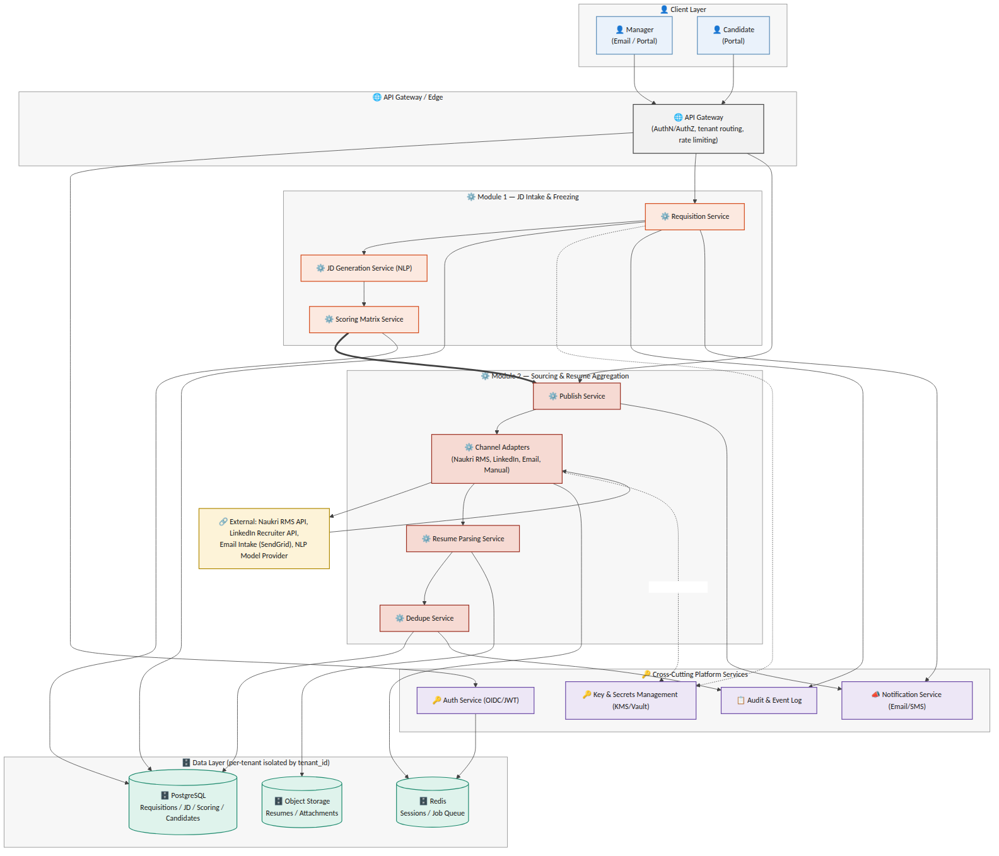{ style="max-width:100%" }

*Figure 2.1 — System architecture: Module 1 & 2 components, cross-cutting services, and data layer*

## 3. AAA — Authentication, Authorization & Session Management
Authentication, authorization, and session handling are platform-wide services consumed by every module, not module-specific logic. This section defines the pattern Module 1 and Module 2 build against; it becomes the standard for all subsequent modules.

### 3.1 Authentication
Most enterprise tenants already run their corporate email and directory on Google Workspace or Microsoft 365 — the platform federates to whichever one a tenant uses instead of asking every employee to hold a separate password. A tenant not on either (a smaller company, or one on a different mail provider) falls back to locally-managed credentials. All three paths converge on the same session-issuance step (Section 3.3); which path a given user takes is a per-tenant configuration choice, not a code fork.

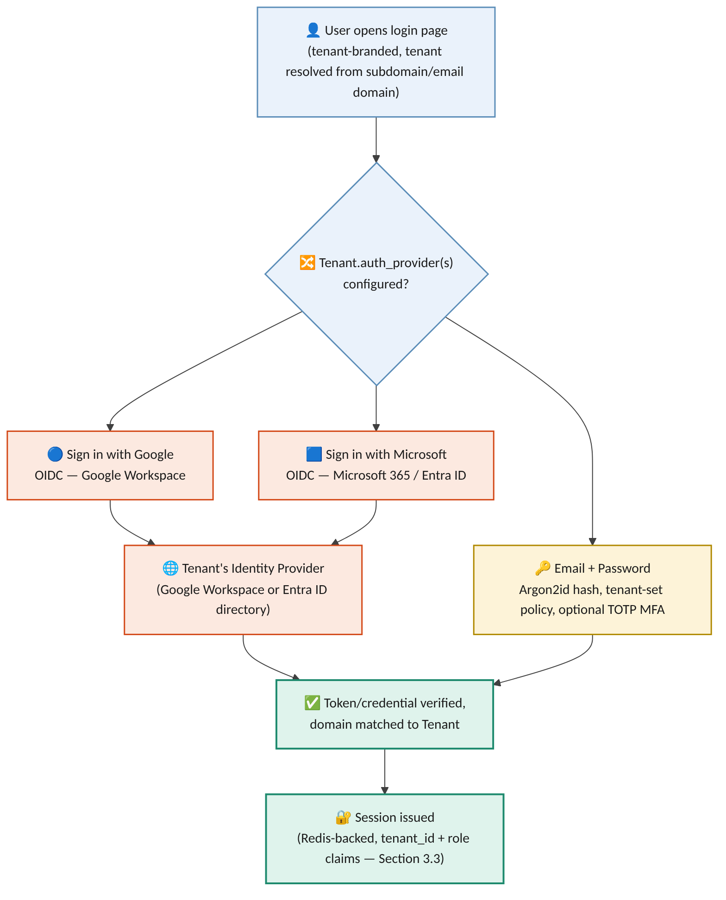{ style="max-width:100%" }

*Figure 3.1 — Authentication paths: federated SSO (Google Workspace / Microsoft 365) and local email + password, converging on one session model*

| **Field** | **Type** | **Notes** |
|----|----|----|
| User.id | UUID (PK) |  |
| User.tenant_id | UUID (FK -\> Tenant), nullable | Null only for a Phoneme Platform Admin, who is not scoped to any tenant |
| User.email | text (unique within tenant) | Also the SSO-matched identity for the federated paths |
| User.auth_method | enum | sso_google \| sso_microsoft \| local_password — set per user, not inferred from the tenant's enabled providers |
| User.password_hash | text, nullable | Argon2id; null whenever auth_method is an SSO path |
| User.mfa_enabled | boolean | Always true for Phoneme Platform Admin; tenant-configurable for local_password users |
| User.role | enum | tenant_admin \| manager \| recruiter_hr (Section 3.2); platform_admin is not tenant-scoped |

- Federated SSO (Release 1, primary path): "Sign in with Google" (OIDC against Google Workspace) and "Sign in with Microsoft" (OIDC against Microsoft 365 / Entra ID) are both supported. A Tenant Admin enables one or both during onboarding and, where the directory supports it, restricts sign-in to their own verified domain(s) — so a Google login cannot be used to reach a tenant that only enabled Microsoft.

- Local email + password (fallback path): for a tenant with no Google Workspace or Microsoft 365 directory — or for any individual account a Tenant Admin chooses to provision manually rather than through SSO — the platform issues local credentials. Passwords are hashed with Argon2id (never reversible, never logged); the Tenant Admin sets the tenant's password policy (minimum length/complexity, expiry if required); Time-based One-Time Passcode (TOTP) multi-factor authentication is available per tenant and mandatory for the Phoneme Platform Admin role regardless of tenant setting.

- A tenant may enable more than one path at once (e.g. Google SSO for most staff, local credentials for a handful of contractors) — User.auth_method is recorded per user, not assumed from the tenant's default.

- Candidates authenticate separately via a magic-link / OTP flow tied to their application record — no password, no standing account, and no relationship to the tenant's chosen provider(s) above.

- All tokens — however issued — carry a tenant_id claim; the API Gateway rejects any request where the token's tenant_id does not match the tenant context of the resource being accessed.

### 3.2 Authorization
Roles form a strict two-tier hierarchy: Phoneme operates the portal itself, and each Tenant (a customer company or staffing agency) administers its own users within it. Nothing below is a Release 1 open question — this is the confirmed access model.

| **Tier** | **Role** | **Scope** |
|----|----|----|
| Platform (Phoneme) | Phoneme Platform Admin | Cross-tenant: tenant provisioning, platform configuration, support break-glass access — every use is fully audited (Section 4.2) and requires TOTP MFA regardless of tenant policy |
| Tenant (per entity) | Tenant Admin | Full control within their own Tenant: user provisioning (SSO or local), role assignment, SSO/password-policy configuration, client management for staffing agencies (Section 5) — never another tenant's data |
| Tenant (per entity) | Manager / Recruiter / HR ("User") | Day-to-day module use within their own Tenant and, for an agency, the Client(s) they are scoped to — cannot alter tenant-level auth or billing configuration |
| Candidate | Candidate | Own application record only, via magic-link — no visibility into any tenant's internal roles or data |

- Role-based access control (RBAC) is enforced at the API Gateway and the service layer, evaluated per-request against (tenant_id, role, resource) — a Manager can only freeze/edit requisitions in their own department unless granted a broader scope by their Tenant Admin.

- A Tenant Admin's authority is bounded by their own tenant_id — provisioning, role changes, and SSO/password-policy configuration all reject a request scoped outside it, with no exception.

- Field-level authorization: PII fields (e.g. candidate salary expectations, BGV data in later modules) are visible only to roles explicitly entitled to them, independent of general resource access.

### 3.3 Session Management
Session state is server-side (Redis-backed) so that revocation is immediate and centrally enforceable — a design choice over purely stateless JWT validation, which cannot be revoked before expiry.

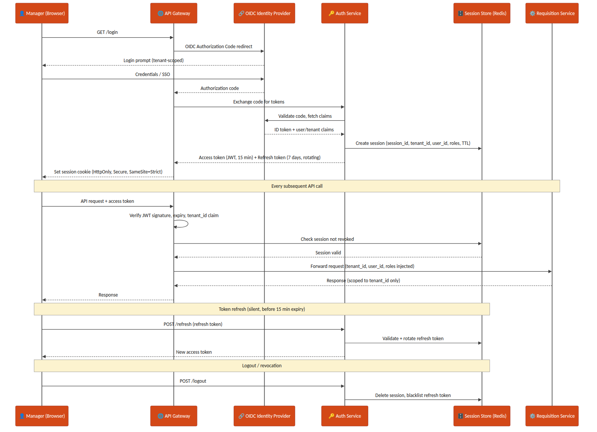{ style="max-width:100%" }

*Figure 3.2 — Manager login, per-request AuthN/AuthZ check, token refresh, and logout/revocation sequence*

- Access tokens: short-lived JWT (15 minutes), signature-verified at the gateway on every request.

- Refresh tokens: 7-day validity, rotating on each use (old refresh token invalidated the moment a new one is issued) to limit replay risk.

- Session cookie: HttpOnly, Secure, SameSite=Strict — never exposed to page JavaScript.

- Logout and administrative revocation both delete the Redis session record and blacklist the associated refresh token immediately.

## 4. Key Management
Every channel credential (Naukri RMS, LinkedIn Recruiter API keys), and every PII field stored at rest, is protected through a KMS plus a secrets-manager layer rather than application-level static secrets.

### 4.0 Native vs. Cloud KMS — On-Prem Hosting Decision
Hosting is on-prem (Section 18) rather than on a hyperscaler, so a hyperscaler-managed KMS (AWS KMS / Azure Key Vault) is not the default reach — either it sits outside the on-prem network boundary the rest of the platform is deliberately inside, or it requires a standing internet-facing dependency for every encrypt/decrypt call, which an on-prem deployment is usually chosen specifically to avoid. The Release 1 default is therefore a native KMS: HashiCorp Vault's Transit Secrets Engine, run as part of the same on-prem Vault HA cluster already used as the secrets manager, with its own root key protected by a PKCS#11-compatible Hardware Security Module (HSM) — this keeps master-key custody entirely inside Phoneme's own infrastructure, which also simplifies the DPDP Act data-residency story (Section 4.2) since no key material or ciphertext ever leaves the premises. A cloud KMS remains available as an optional hybrid path for a specific customer who separately requires cloud-based DR replication, but that is a fast-follow scenario, not the Release 1 baseline — see Section 16.

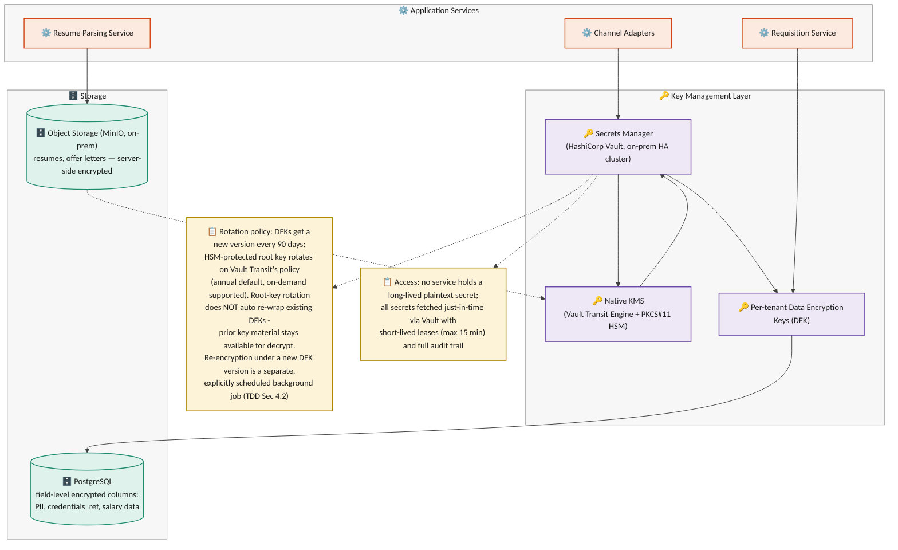{ style="max-width:100%" }

*Figure 4.1 — Key management layer: native KMS, secrets manager, per-tenant data-encryption keys, and encrypted storage*

### 4.1 Principles
- No service ever holds a long-lived plaintext secret. Channel credentials are fetched just-in-time from the secrets manager (HashiCorp Vault, on-prem HA cluster) with short-lived leases (max 15 minutes).

- Envelope encryption: the native KMS (Vault Transit Engine, HSM-backed root key) holds the master key; per-tenant Data Encryption Keys (DEKs) are generated, wrapped by the master key, and used to encrypt tenant data — the master key itself never leaves the HSM boundary.

- PII and sensitive fields (SourcingChannelConfig.credentials_ref, candidate salary/compensation data introduced in later modules) are encrypted at the column level in PostgreSQL using the tenant's DEK; resumes and offer documents in object storage (MinIO, on-prem — Section 18) use server-side encryption sourced from the same native KMS.

### 4.2 Rotation & Audit
- Three distinct operations are kept separate, mirroring the same distinction a cloud KMS provider draws between key rotation and data re-encryption, which applies equally to the native KMS: (1) KMS root-key rotation, (2) per-tenant DEK rotation, and (3) re-encryption of already-stored data. Conflating these was flagged as a design error in the v1.1 draft and is corrected here.

- KMS root-key rotation: Vault Transit rotates the root key on a configured schedule (annual default) or on-demand. As with a cloud KMS's automatic rotation, rotation generates new key material for future encrypt operations, but existing wrapped DEKs are not automatically re-wrapped — Vault retains all prior key versions internally so those DEKs continue to unwrap and decrypt correctly without any action. Re-wrapping a DEK under a specific newer key version is a distinct, explicit operation (see re-encryption below), never an automatic side effect of root-key rotation.

- Per-tenant DEK rotation: a new DEK version is generated every 90 days (or on-demand, e.g. after a suspected compromise). Each encrypted record/object stores a key_version reference alongside its ciphertext, so newly written data immediately uses the current DEK version while existing data remains readable under its original version — rotation does not require synchronous re-encryption of the whole tenant's data set.

- Re-encryption of existing data under a new DEK version is a separate, explicitly-scheduled background job (not an implicit side effect of rotation), run tenant-by-tenant with progress tracked per table/object-storage prefix; if a re-encryption job is interrupted, it resumes from the last completed batch using the recorded key_version watermark rather than restarting or leaving mixed-version data unaccounted for.

- Every secret access is logged to the Audit & Event Log with requester identity, tenant_id, and purpose — required both for SOC2-style controls and for DPDP Act accountability obligations.

- Credential rotation for a sourcing channel (e.g. a new Naukri RMS API key) is a Tenant Admin action that writes a new SourcingChannelConfig.credentials_ref without any service restart.

## 5. Tenant & Organization Model
Release 1 includes the staffing-agency multi-client tenant model as an in-scope requirement (not deferred): a single agency Tenant manages requisitions and candidates on behalf of multiple end-client companies, alongside the simpler direct-employer case where a Tenant has no clients at all. This section is written as a platform-wide concern — Module 1 and Module 2 both consume it rather than each defining their own isolation rules — and is a first candidate for extraction into a standalone Shared SaaS Platform Specification once that document exists. Release 1 supports internal agency users (Recruiter/HR, Tenant Admin) accessing client-scoped data; the end-client-facing Client Stakeholder role is out of scope for Release 1 (Section 1.2, Section 16). This section defines Tenant/Client as the data-scoping model; the role hierarchy that sits on top of it — Phoneme Platform Admin above every Tenant Admin, who in turn administers their own Tenant's Users — is defined in Section 3.2 and applies uniformly here.

### 5.1 Entities
| **Field** | **Type** | **Notes** |
|----|----|----|
| Tenant.id | UUID (PK) |  |
| Tenant.org_type | enum | direct_employer \| staffing_agency |
| Tenant.name | text |  |
| Client.id | UUID (PK) | Exists only for staffing_agency tenants |
| Client.agency_tenant_id | UUID (FK -\> Tenant) | The agency that manages this end-client relationship |
| Client.name | text |  |
| Client.status | enum | active \| offboarded |

### 5.2 Scoping Rule
Every record that belongs to a requisition, candidate, or application carries both tenant_id (mandatory, always) and client_id (mandatory for staffing_agency tenants, explicitly null for direct_employer tenants). A direct-employer tenant is modeled as the degenerate case of an agency with exactly zero clients — this keeps a single code path rather than branching application logic by org_type.

Explicit null vs. absent field: for a direct_employer tenant, client_id = null is the one valid, expected value — it is set deliberately, not left out. A request/event/record that OMITS the client_id field entirely (as opposed to supplying it as null) is always a validation error (422) regardless of tenant org_type, at every layer in Section 5.3 — API request bodies, event envelopes, and webhook payloads alike. This distinguishes "this tenant has no client, by design" (valid null) from "the caller forgot to populate this field" (rejected as malformed), which earlier drafts of this section did not separate.

### 5.3 Isolation Enforcement Matrix
Tenant isolation is stated as a requirement in the BRD/PRD, but stating it is not the same as enforcing it at every layer data passes through. Enforcement is defined per layer, not assumed to follow from the database schema alone:

| **Layer** | **Enforcement Mechanism** |
|----|----|
| Database (PostgreSQL) | Row-level filtering on (tenant_id, client_id) is applied both by a mandatory query-builder middleware for application-code paths, and by native PostgreSQL Row-Level Security (RLS) policies on every multi-tenant table as the layer-of-last-resort — RLS is enabled specifically so a raw-SQL script, an ad-hoc analytics query, or a background/batch job connecting directly to the database cannot bypass tenant scoping simply by not going through the application's query builder. A connection's tenant/client context is set via a session variable checked by the RLS policy; a connection with no context set sees zero rows, never all rows. A query with neither key fails to compile at the application layer as an additional check, but RLS is what holds even when that layer is bypassed |
| Message queue / events | Every event envelope (e.g. requisition.frozen) carries tenant_id (always) and client_id (present and explicitly null for a direct-employer tenant, per Section 5.2); consumers reject and dead-letter any message where either field is absent from the envelope — a present null client_id is valid and is not dead-lettered |
| Search / candidate index | tenant_id + client_id are mandatory partition/filter keys set server-side from the authenticated session — never accepted as client-supplied query parameters |
| Object storage (resumes, offer documents) | Storage key is prefixed by tenant_id/client_id, and the IAM policy attached to each service's storage credentials is itself scoped to that prefix pattern (not merely to the bucket) — so a credential compromise or an application-layer bug that leaks another tenant's key still cannot read across the prefix boundary at the storage layer; a direct_employer object uses a fixed client segment (e.g. "\_none") in its key rather than omitting the segment, keeping the prefix pattern uniform |
| Webhooks / external identity | Idempotency and identity matching are scoped to (tenant_id, integration_account_id, channel_type, external_id) — not channel_type + external_id alone, since two tenants (or two clients under one agency) may run independent integration accounts on the same channel with overlapping vendor-side IDs |

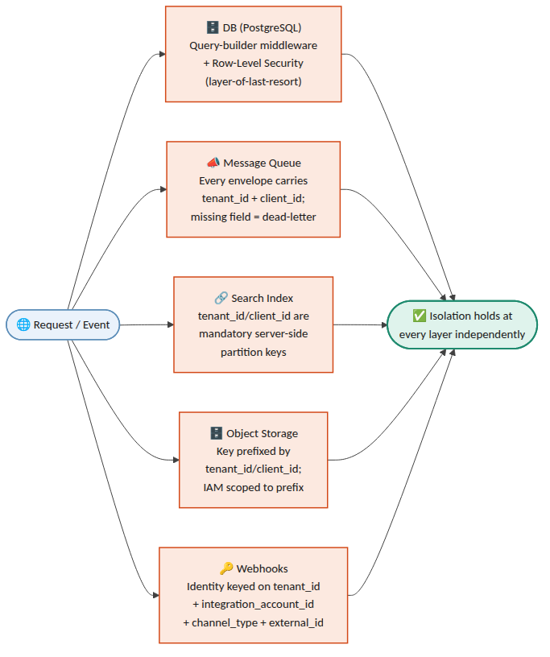{ style="max-width:100%" }

*Figure 5.1 — Isolation enforcement layers: how every request/event is scoped independently at each of the five layers*

## 6. Data Model — Module 1 (JD Intake & Freezing)
### 6.0 Authoritative State Model — JobRequisition vs. JDVersion
Two distinct state machines are in play, and every other section (data model, APIs, sequence flows, error handling, the object-flow diagram) must agree with this one table rather than restate its own version. JobRequisition.status tracks the requisition as a whole (is it open, on hold, closed); JDVersion.status tracks one specific version of the JD content within that requisition (is this particular draft the currently approved one). A requisition can be Frozen_Open (an Approved version exists and sourcing is live) while a new JDVersion for the same requisition is independently sitting in Draft/Revising/PendingApproval as a proposed revision — the two are not the same field and do not transition in lockstep.

| **State machine** | **Values (authoritative)** | **Notes** |
|----|----|----|
| JobRequisition.status | Draft → PendingApproval ⇄ Revising → Frozen_Open ⇄ OnHold → Closed | Draft/PendingApproval/Revising describe the requisition before its first freeze; once any version has been Approved at least once, the requisition itself is Frozen_Open (or OnHold/Closed) even while a later JDVersion revision is separately mid-review |
| JDVersion.status | Draft → Revising ⇄ PendingApproval → Approved → Superseded (or → Rejected from Draft/Revising/PendingApproval) | Per-version content lifecycle. Revising was omitted from the field-table enum in an earlier draft of this section — corrected below to match its use throughout Sections 8, 12, 14 and 15. Revising and PendingApproval are distinct: PendingApproval means "sent to the manager, awaiting a decision"; Revising means "manager requested changes, a new draft is being generated/edited" — a version cycles PendingApproval ⇄ Revising through the review loop before its eventual Approved or Rejected |

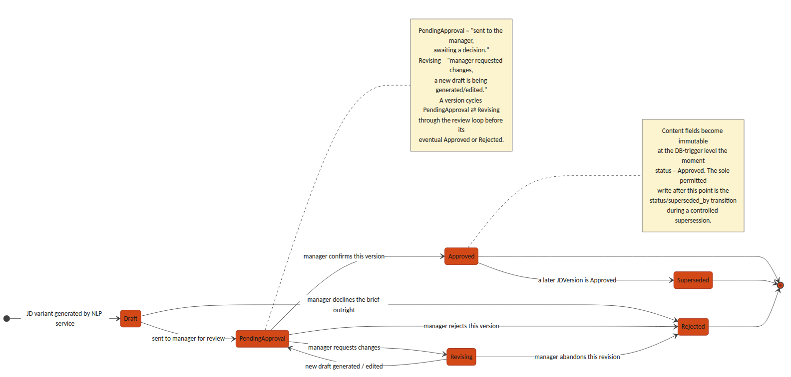{ style="max-width:100%" }

*Figure 6.1 — JDVersion.status state machine: the per-version content lifecycle distinct from JobRequisition.status*

**JobRequisition**

| **Field** | **Type** | **Notes** |
|----|----|----|
| id | UUID (PK) |  |
| tenant_id | UUID (FK) | Every query scoped by this field — see Section 5.3 |
| client_id | UUID (FK -\> Client, nullable) | Mandatory (non-null) for staffing_agency tenants; explicitly null (a valid, expected value, not merely permitted) for direct_employer tenants — see Section 5.2's null-vs-absent distinction |
| department_id | UUID (FK) | Nullable if not supplied in the brief; flagged for manager confirmation |
| status | enum | Draft \| PendingApproval \| Revising \| Frozen_Open \| OnHold \| Closed |
| active_version_id | UUID (FK -\> JDVersion, nullable) | The single currently-approved JD version; see Section 6's JDVersion notes for the immutable-history model this pointer enables |
| created_by | UUID (FK -\> User) | The manager who submitted the brief |
| created_at / updated_at | timestamp |  |

**JDBrief (raw intake)**

| **Field**      | **Type**  | **Notes**              |
|----------------|-----------|------------------------|
| id             | UUID (PK) |                        |
| requisition_id | UUID (FK) |                        |
| raw_text       | text      | Verbatim manager brief |
| source         | enum      | email \| portal        |
| received_at    | timestamp |                        |

**JDField (NLP-extracted structured fields)**

Keyed to the specific JDVersion it was extracted for and confirmed against, not only to the requisition — otherwise a later revision's field edits would silently rewrite the confirmed-field snapshot that an earlier Approved version's ScoringCriterion.source_field_ref (see ScoringMatrix/ScoringCriterion below) points to, for the same historical-drift reason that section keys the matrix to jd_version_id rather than requisition_id.

| **Field** | **Type** | **Notes** |
|----|----|----|
| id | UUID (PK) |  |
| requisition_id | UUID (FK) | Denormalized for query convenience; jd_version_id is the field's true owning scope |
| jd_version_id | UUID (FK -\> JDVersion) | Which version's extraction/confirmation this field snapshot belongs to; a new JDVersion gets its own JDField rows rather than reusing/mutating the prior version's |
| field_name | enum | role_title \| experience_range \| education_pref \| comp_band \| job_role_tag \| must_have_skills \| domain_competencies \| soft_skills \| department \| target_start_date |
| field_value | text / JSON |  |
| confidence_score | decimal (0–1) | Below tenant-configured threshold (default 0.75) → manager_confirmed forced false |
| manager_confirmed | boolean | Gate before this field can feed an Approved JD version |

**JDVersion — immutable-history model**

A JD revised after its initial approval must not overwrite history: any assessment, matrix, or downstream record that referenced an approved version has to keep resolving to the exact content that was approved at the time, even after a later revision supersedes it. JDVersion.status therefore replaces the earlier is_frozen boolean with a full lifecycle, and JobRequisition.active_version_id (Section 6) is the single pointer to "the current one" — approved versions themselves are never deleted or edited, only superseded.

| **Field** | **Type** | **Notes** |
|----|----|----|
| id | UUID (PK) |  |
| requisition_id | UUID (FK) |  |
| version_no | integer | Monotonically increasing per requisition |
| variant_type | enum | formal \| candidate_friendly \| condensed \| manager_edited |
| content | text |  |
| generated_by | enum | system \| manager |
| status | enum | Draft \| Revising \| PendingApproval \| Approved \| Superseded \| Rejected — see Section 6.0 for the authoritative transition table (Revising was missing from an earlier draft of this row; corrected here to match its use elsewhere in this document) |
| superseded_by | UUID (FK -\> JDVersion, nullable) | Set only when status transitions Approved → Superseded, pointing at the version that replaced it |
| created_at | timestamp |  |

- A requisition can have at most one version with status = Approved at any moment, matching JobRequisition.active_version_id.

- Immutability, precisely defined: once a version reaches Approved, its content-bearing fields (version_no, variant_type, content, generated_by) are immutable — a DB-level trigger rejects any UPDATE that touches them. The status and superseded_by columns are the sole, explicit exception: the freeze/supersede transaction is permitted to write status = Superseded and superseded_by on the prior Approved row as part of approving its replacement, and this is the only UPDATE path the trigger allows against an Approved row. This is a controlled metadata transition, not a general relaxation of immutability — content is never touched after Approved.

- Revising an already-approved JD does not touch that row: it creates a new Draft version that goes through the normal review loop (Draft → Revising ⇄ PendingApproval); only when the new version is approved does the transaction (a) set the new version's status to Approved, (b) set the previous Approved version's status to Superseded and its superseded_by per the exception above, and (c) repoint JobRequisition.active_version_id — all three in one atomic write.

- Any record that must remain accurate to "the JD as it was when X happened" (a ScoringMatrix, a JDField snapshot, a candidate assessment, an audit log entry) stores a direct jd_version_id foreign key, never a lookup through the requisition — so it keeps resolving correctly regardless of later supersession.

**ScoringMatrix / ScoringCriterion — versioned with the JD, not the requisition**

A scoring matrix belongs to the JD version it was approved alongside, not to the requisition as a whole — otherwise revising a JD after freeze would silently rewrite the matrix that earlier assessments were scored against. Draft criteria are generated, retrieved, and edited before approval; see Section 8's draft-matrix endpoints for the API sequence this table supports.

| **Field** | **Type** | **Notes** |
|----|----|----|
| ScoringMatrix.id | UUID (PK) |  |
| ScoringMatrix.jd_version_id | UUID (FK -\> JDVersion) | One matrix per JD version, not per requisition — preserves a distinct matrix for every approved version in the requisition's history |
| ScoringMatrix.status | enum | Draft \| Approved. Approved is immutable, set atomically with the JD version's Draft → Approved transition |
| ScoringMatrix.approved_at | timestamp | Set only when status becomes Approved |
| ScoringCriterion.id | UUID (PK) |  |
| ScoringCriterion.matrix_id | UUID (FK) |  |
| ScoringCriterion.category | enum | core_skills \| experience_seniority \| domain_competency \| education_fit — screening-stage only, sums to 100. behavioral_proxy is deliberately excluded: soft-skill and behavioral evidence is never expressed as a numeric screening criterion (BRD/PRD Section 4.1, Approved Decisions) and is assessed only at interview, out of scope of this document |
| ScoringCriterion.criterion_name | text | e.g. "Power BI proficiency" |
| ScoringCriterion.weight_percent | decimal | All Approved criteria for a matrix sum to exactly 100; a Draft matrix may be temporarily incomplete while a manager is still editing it |
| ScoringCriterion.source_field_ref | UUID (FK -\> JDField) | Traceability back to the JD field that generated this criterion |

## 7. Data Model — Module 2 (Sourcing & Resume Aggregation)
### 7.1 Entities
**SourcingChannelConfig — now scoped as an integration account**

A channel configuration is scoped to (tenant_id, client_id) rather than tenant_id alone, since an agency tenant commonly needs independent vendor credentials per client (each end-client has its own Naukri RMS employer account, for example). This is what Section 5.3's webhook idempotency rule scopes against.

| **Field** | **Type** | **Notes** |
|----|----|----|
| id | UUID (PK) | Functions as the integration_account_id referenced throughout this document |
| tenant_id | UUID (FK) |  |
| client_id | UUID (FK -\> Client, nullable) | Set for staffing_agency tenants; identifies which client this integration account posts/sources on behalf of |
| channel_type | enum | naukri_rms \| linkedin_recruiter \| niche_board \| email_intake \| manual_upload \| referral |
| credentials_ref | UUID (FK -\> Secret store) | Never stored in plaintext in this table |
| is_active | boolean |  |

**Candidate**

| **Field** | **Type** | **Notes** |
|----|----|----|
| id | UUID (PK) |  |
| tenant_id | UUID (FK) | Reusable across requisitions within a tenant |
| client_id | UUID (FK -\> Client, nullable) | Agency tenants: the client this candidate was sourced for. A candidate applying to two different clients under the same agency gets two Candidate rows — deliberately not shared, so one client's view of a candidate never leaks to another |
| name / email / phone | text | Primary dedupe keys, scoped within (tenant_id, client_id) — see DuplicateMatch below |
| resume_file_ref | UUID (FK -\> object storage) |  |
| parsed_json | JSONB | Structured output of the Resume Parsing Service |
| source_channel | enum | Matches SourcingChannelConfig.channel_type at first intake |
| created_at | timestamp |  |

**Application**

| **Field** | **Type** | **Notes** |
|----|----|----|
| id | UUID (PK) |  |
| candidate_id | UUID (FK) |  |
| requisition_id | UUID (FK) |  |
| tenant_id | UUID (FK) | Denormalized from both candidate_id and requisition_id (which must agree) — an explicit column rather than a join, so the RLS policy and query-builder middleware in Section 5.3 apply directly to this table like every other multi-tenant table, instead of Application being the one table that only reaches scoping indirectly |
| client_id | UUID (FK -\> Client, nullable) | Denormalized from the requisition for isolation-filter simplicity — see Section 5.3 |
| status | enum | Feeds Module 3 pipeline stage — out of scope of this TDD beyond intake |
| applied_at | timestamp |  |

- Tenant/client scoping on Module 1 child tables (JDBrief, JDField, JDVersion, ScoringMatrix, ScoringCriterion): these intentionally do not carry their own tenant_id/client_id columns — they inherit scope through their parent JobRequisition (directly, or via jd_version_id → JobRequisition for JDVersion-keyed tables). This is a deliberate design choice, not an oversight: the RLS policies in Section 5.3 on these tables are join-based (checking the parent JobRequisition's tenant_id/client_id), and an insert/update trigger rejects any row whose parent-chain tenant/client would disagree with a value passed explicitly — so a JDField cannot be attached to a requisition in a different tenant than the field's own (would-be) tenant_id, even though the column doesn't exist to set incorrectly in the first place. Candidate, Application, SourcingChannelConfig, and DuplicateMatch's parent Candidates carry explicit tenant_id/client_id columns because they are queried directly and at volume (search, dedupe, webhooks) where a join-based policy alone would be a performance concern.

**DuplicateMatch — conflict, reversal, and audit**

Matching is scoped within (tenant_id, client_id) — the same person applying through two different agency clients is not treated as a duplicate, by design (Candidate note above). Within that scope, an exact-key match (email or phone) is not always safe to auto-link: the same phone number can be reused by a different person, or two sources can disagree on the name attached to one email. Conflicting evidence is routed to a recruiter rather than silently auto-linked, and every resolution — link or reject — is recorded rather than only the current state.

| **Field** | **Type** | **Notes** |
|----|----|----|
| id | UUID (PK) |  |
| candidate_id_primary / candidate_id_duplicate | UUID (FK) |  |
| match_type | enum | exact_email \| exact_phone \| content_similarity |
| confidence_score | decimal (0–1) | See Section 14 for thresholds |
| conflict_flag | boolean | True when exact-key evidence is accompanied by materially conflicting attributes (different name, different declared employer) — forces manual review even for an exact_email/exact_phone match_type |
| resolution | enum | pending \| linked \| rejected_not_duplicate \| reversed. Replaces the earlier plain resolved boolean, which could not distinguish "confirmed duplicate" from "confirmed not a duplicate" |
| previous_decision_id | UUID (FK -\> DuplicateMatch, nullable) | Set only on a reversed row; points at the prior decision row (for the same candidate pair) that this row corrects. Null on every row that is not itself a reversal |
| resolved_by / resolved_at | UUID (FK -\> User) / timestamp |  |
| resolution_notes | text | Free-text rationale captured from the recruiter — required when resolution is rejected_not_duplicate or reversed |

- Append-only decision model (the single authoritative model — Section 14/15 must not restate this differently): a resolution decision is never edited in place once written. Reversing an earlier match does not set resolution = reversed on the original row; it INSERTS a new DuplicateMatch row for the same candidate pair, with resolution = reversed and previous_decision_id pointing at the row being corrected. The original row is retained exactly as it was decided, unmodified, alongside the correction.

- Current-link state for a candidate pair is derived, not stored on a single row: it is the resolution of the most recent row (by resolved_at) for that (candidate_id_primary, candidate_id_duplicate) pair. Application code and reporting must always resolve current state this way rather than reading resolution off an arbitrary matching row, since older rows for the same pair remain in the table by design.

- Application/source history is never destructively merged: when two Candidate rows are linked as duplicates, each retains its own Application and source_channel history; linking establishes a relationship between them, it does not collapse one record into the other.

### 7.2 Consolidated Data Schema (Module 1 & 2)
The entity-relationship diagram below consolidates every table introduced in Sections 5, 6 and 7 into a single schema view, showing primary/foreign-key relationships across the two modules — including how an Approved ScoringMatrix traces back to the JDField it was derived from, and how Candidate/Application/DuplicateMatch tie together for the unified inbox.

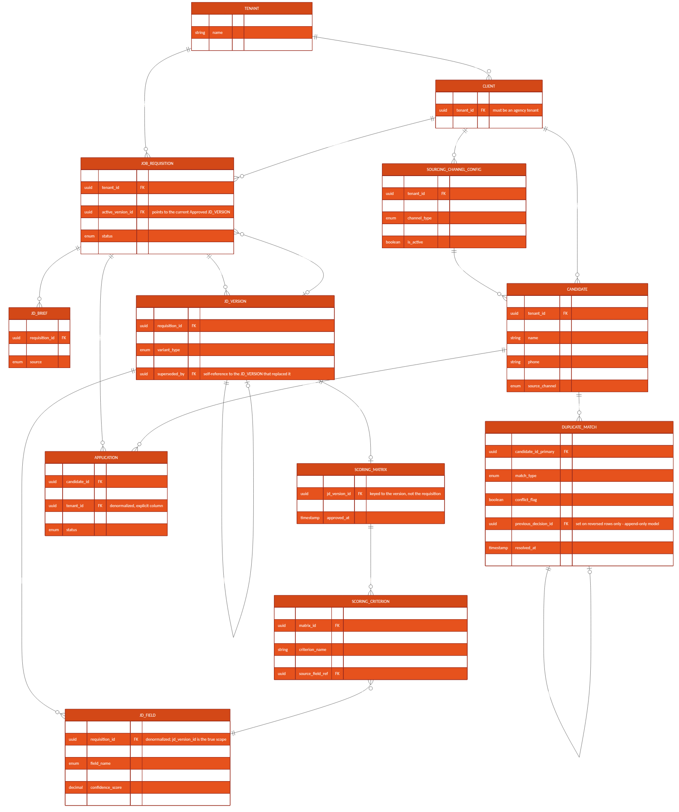{ style="max-width:100%" }

*Figure 7.1 — Consolidated entity-relationship diagram, Module 1 & 2*

## 8. API Contracts — Module 1
**POST /api/v1/requisitions/intake**

Creates a requisition from a manager's raw brief and kicks off NLP extraction.

Request: { "tenant_id": "uuid", "client_id": "uuid\|null", "department_id": "uuid\|null", "raw_brief_text": "string", "source": "email\|portal" } Response: 201 { "requisition_id": "uuid", "status": "Draft" } Errors: 422 if client_id is missing for a staffing_agency tenant, or supplied for a direct_employer tenant

**GET /api/v1/requisitions/{id}/jd-versions**

Lists all JD versions for a requisition, in version order, including their status (Draft / PendingApproval / Approved / Superseded / Rejected) — the full immutable history, not only the current one.

**POST /api/v1/requisitions/{id}/jd-versions/{versionId}/feedback**

Submits manager feedback (email reply or portal form) for NLP parsing into a structured diff and a new draft version.

Request: { "feedback_text": "string", "source": "email\|portal" } Response: 202 { "new_version_id": "uuid", "status": "Revising", "low_confidence_fields": \["string", ...\] }

**GET /api/v1/requisitions/{id}/jd-versions/{versionId}/scoring-matrix/draft**

Returns the in-progress draft ScoringCriterion set bound to this specific JD version (versionId), for the manager to review before freezing. Identifying the matrix by (requisition, version) rather than by requisition alone matters because a requisition can have more than one JDVersion in flight across review rounds (Section 6.0) — an endpoint keyed only on requisition_id would be ambiguous about which draft it means. A draft matrix need not sum to 100 percent — it can be incomplete while under active editing.

Response: 200 { "matrix_id": "uuid", "jd_version_id": "uuid", "status": "Draft", "matrix_revision": integer, "criteria": \[ { "criterion_id", "criterion_name", "category", "weight_percent" }, ... \], "current_total_percent": number }

**PATCH /api/v1/requisitions/{id}/jd-versions/{versionId}/scoring-matrix/draft**

Manager edits draft criterion weights (via the scoring-matrix slider UI) before freeze. Validated only against per-criterion bounds at this stage — the sum-to-100 rule is enforced at freeze, not on every intermediate edit, so a manager can save a partial adjustment mid-session. Optimistic concurrency: the request must echo the matrix_revision last read; a mismatch (another edit landed first, e.g. two browser tabs, or the version was regenerated by a new feedback round) is rejected rather than silently overwriting a concurrent edit, and the response returns the current state for the caller to re-apply against.

Request: { "matrix_revision": integer, "criteria": \[ { "criterion_id": "uuid", "weight_percent": number }, ... \] } Response: 200 { "status": "Draft", "matrix_revision": integer, "current_total_percent": number } Errors: 409 { "reason": "revision_mismatch", "current_matrix_revision": integer, "current_criteria": \[...\] } if matrix_revision does not match the current row

**POST /api/v1/requisitions/{id}/freeze**

Approves a specific JD version and its draft scoring matrix in a single atomic transaction — the Approved Decision (BRD/PRD Section 4.1) that freezing is a hard, content-immutable state change (Section 6's immutability-exception note applies). If the requisition already has an Approved version, that version is superseded (not overwritten) and JobRequisition.active_version_id repoints to the newly approved one; the superseded version and its matrix remain queryable by their own ID for any assessment that already referenced them.

Idempotency and replay vs. conflict, distinguished (resolving the earlier ambiguity between the no-op-retry requirement and the general 409-on-invalid-state rule): the caller supplies expected_active_version_id, the active_version_id it last observed for the requisition (null if none yet). The server compares it against the requisition's actual current active_version_id before proceeding.

| **Case** | **Server behavior** |
|----|----|
| approved_version_id is already the requisition's active_version_id (an exact repeat of a freeze that already succeeded) | 200, no-op — returns the same response the original successful call returned; no new version, no new Superseded row, no duplicate matrix |
| expected_active_version_id matches the requisition's actual current active_version_id, and approved_version_id is a PendingApproval version awaiting this decision | Proceeds: approves approved_version_id, supersedes the prior active version if any, repoints active_version_id — normal path |
| expected_active_version_id does NOT match the requisition's actual current active_version_id (someone else's freeze — of this or a different version — landed first) | 409 { "reason": "stale_expected_version", "current_active_version_id": "uuid" } — the two simultaneous-freeze race is resolved this way: exactly one caller's expected_active_version_id matches at commit time |
| approved_version_id is not in PendingApproval status and is not already the active version (e.g. Draft, Rejected, or a different Superseded version) | 409 { "reason": "version_not_approvable" } |

Request: { "approved_version_id": "uuid", "expected_active_version_id": "uuid\|null" } Response: 200 { "status": "Frozen_Open", "active_version_id": "uuid", "scoring_matrix_id": "uuid", "superseded_version_id": "uuid\|null" } Errors: 409 (see table above) if the draft matrix's criteria do not sum to exactly 100

**GET /api/v1/requisitions/{id}/scoring-matrix**

Returns the Approved scoring matrix bound to the requisition's current active_version_id, for consumption by the Module 3 scoring engine. Callers needing the matrix behind a specific historical (superseded) JD version query it directly by jd_version_id instead.

## 9. API Contracts — Module 2
**POST /api/v1/requisitions/{id}/publish**

Triggered automatically on requisition freeze (or manually re-triggered by a recruiter); fans out to every active SourcingChannelConfig (integration account) scoped to the requisition's (tenant_id, client_id).

**POST /webhooks/naukri-rms/applications**

Inbound webhook (or polling result) from Naukri RMS carrying a new application/resume. Idempotency and identity resolution are keyed on (integration_account_id, external_application_id) — integration_account_id is the SourcingChannelConfig.id resolved from the webhook's registered endpoint, which already encodes tenant_id and client_id (Section 5.3).

Request (from Naukri RMS): { "external_application_id": "string", "requisition_external_ref": "string", "resume_url": "string", "applicant": { "name", "email", "phone" } } Response: 202 { "candidate_id": "uuid", "application_id": "uuid", "duplicate_check": "queued" }

**POST /webhooks/linkedin-recruiter/applications**

Equivalent inbound contract for LinkedIn Talent Solutions, same idempotency scoping as above. Which specific LinkedIn Talent Solutions product (Recruiter System Connect, Apply Connect, or another) this integrates with is not yet confirmed — see Section 16.

**POST /webhooks/email-intake/resume**

Inbound-email-parse webhook: dedicated per-(tenant, client) intake address receives an email with a resume attachment; the email provider's inbound-parse service posts the parsed MIME payload here.

**POST /api/v1/candidates/upload**

Manual single/bulk upload path used by recruiters as the universal fallback for channels without an API.

**GET /api/v1/candidates/search**

Full-text and filtered search across the caller's (tenant_id, client_id)-scoped candidate pool — backs the unified resume inbox and Module 2's candidate database search feature. client_id is resolved server-side from the authenticated session, never accepted as a caller-supplied filter (Section 5.3).

Query params: q, skills\[\], experience_min, experience_max, source_channel\[\], requisition_id, page, page_size

## 10. Integration Specifications
### 10.1 Naukri RMS
- Status: proposed internal adapter contract — Naukri RMS partner-agreement terms and exact API capabilities are not yet confirmed; treat this section as the integration Phoneme intends to build against, pending vendor confirmation (Section 16).

- Auth: OAuth2 client-credentials, per-integration-account contracted employer account.

- Direction: confirm at vendor onboarding whether push (webhook) or poll is available under the contracted plan — Section 16 lists this as an open technical decision.

- Rate limits: respect vendor-published limits; Publish Service applies exponential backoff on 429 responses.

### 10.2 LinkedIn Talent Solutions
- Status: proposed internal adapter contract. LinkedIn documents multiple distinct Talent Solutions integration products (e.g. Recruiter System Connect, Apply Connect) with different capabilities; "LinkedIn Recruiter API" as used elsewhere in this document is a placeholder pending confirmation of which specific product Phoneme contracts for — this is a vendor-feasibility gate, not a detail to resolve during implementation (Section 16).

- Auth: OAuth2 authorization-code flow, requiring a per-integration-account recruiter to grant consent once during channel setup.

- Token refresh handled by the channel adapter; a failed refresh marks the channel Integration Error and alerts the tenant admin without blocking other channels.

### 10.3 Email Intake
- A dedicated per-(tenant, client) intake address, provisioned at integration-account setup, routed through a transactional-email provider's inbound-parse webhook (e.g. SendGrid Inbound Parse or equivalent).

- Attachment extraction feeds the Resume Parsing Service; the email body itself is retained for audit but is not parsed for structured fields.

### 10.4 Resume Parsing Service
- Release 1 supported formats: PDF and DOCX only, matching the BRD/PRD's scope statement (a broader "any resume format" claim in earlier drafts has been corrected — see BRD/PRD Change Log). Other formats (.doc, .rtf, .pages, images) are rejected at upload/intake with an explicit unsupported-format error, not silently dropped.

- Scanned/image-only PDFs (no extractable text layer) and password-protected files are detected and routed to the same manual structured-entry fallback used for NLP extraction failure (Section 15), rather than failing silently or producing an empty parse.

- Returns structured JSON (contact, work history, skills, education) with a per-field confidence score, consistent with the JDField confidence model in Module 1.

- Build-vs-buy is an open decision — see Section 16.

## 11. Data Flow Diagrams
The Level-1 data flow diagram below traces information from the manager's raw brief through JD generation, freezing, and scoring-matrix creation (Module 1), and from a published requisition through candidate sourcing, parsing and dedupe to the unified candidate store (Module 2) — ending at the handoff into Module 3 (Screening & Shortlisting).

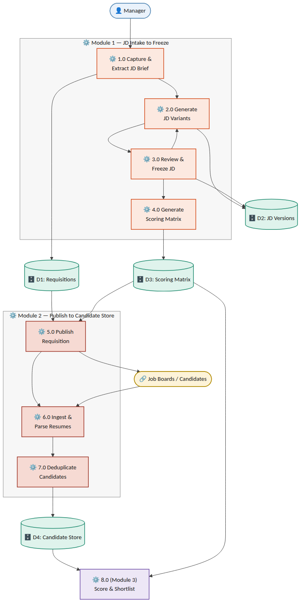{ style="max-width:100%" }

*Figure 11.1 — Level-1 data flow diagram, JD Intake → Freeze → Publish → Sourcing → Candidate Store*

## 12. Sequence Flows
### 12.1 Module 1 — JD Intake to Freeze
1.  Manager → Email/Portal: submits raw brief.

2.  Requisition Service: creates JobRequisition (status Draft) and JDBrief record.

3.  JD Generation Service: runs NLP extraction → JDField records; generates 2–3 JDVersion drafts plus a draft ScoringMatrix/ScoringCriterion set.

4.  Notification Service: emails manager, updates portal Pending JD Approval queue.

5.  Manager → Email reply or Portal edit: feedback submitted via POST .../feedback, and/or draft matrix weights adjusted via PATCH .../scoring-matrix/draft.

6.  JD Generation Service: parses feedback into a structured diff → new JDVersion (status Revising). Loop to step 4 until manager freezes.

7.  SLA Scheduler: if no manager response within the configured window, triggers a reminder, then an HR escalation notification.

8.  Manager → POST .../freeze: approves the PendingApproval version and its draft matrix in one atomic transaction.

9.  Scoring Matrix Service: sets the new JDVersion.status = Approved and its ScoringMatrix.status = Approved; if a previously Approved version existed, sets it to Superseded; repoints JobRequisition.active_version_id and sets status = Frozen_Open.

10. Requisition Service: emits requisition.frozen event (carrying tenant_id, client_id, active_version_id), consumed by the Module 2 Publish Service.

### 12.2 Module 2 — Publish to Unified Candidate Record
1.  Publish Service: consumes requisition.frozen; calls each active channel adapter (integration account) scoped to the requisition's (tenant_id, client_id).

2.  Channel Adapter (Naukri RMS / LinkedIn / email / manual / referral): posts the requisition or begins listening/polling for applications.

3.  Inbound application/resume arrives via webhook, poll result, or manual upload, identified by (integration_account_id, external_application_id).

4.  Resume Parsing Service: extracts structured candidate fields; tags source_channel; routes unsupported/unparseable files to manual fallback (Section 15).

5.  Dedupe Service: checks against existing Candidate records scoped to (tenant_id, client_id) (see Section 14 for match logic and Section 7.1's DuplicateMatch conflict handling); links to an existing record, creates a new one, or routes to manual review on conflicting evidence.

6.  Candidate Store: persists/updates Candidate and Application; Unified Inbox Index makes the record searchable.

## 13. Object Flow Diagram — JobRequisition Lifecycle
The JobRequisition entity is the central object driving Module 1; its state machine gates every other action (JD editing, freeze, scoring-matrix generation, publish). The diagram below is the authoritative object-flow reference for implementation — every state transition must go through the guarded transitions shown, never a direct field update.

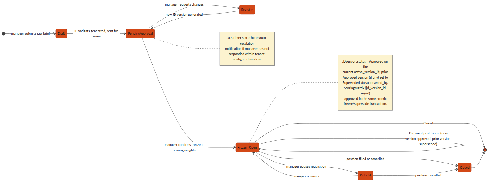{ style="max-width:100%" }

*Figure 13.1 — JobRequisition object/state flow, Draft through Closed*

## 14. Non-Functional / Technical Considerations
- Idempotency: every inbound webhook endpoint (Naukri RMS, LinkedIn, email intake) is keyed on (integration_account_id, external_application_id), which is itself scoped to a (tenant_id, client_id) integration account — so a vendor retry cannot create a duplicate Candidate/Application, and two different tenants' or clients' external IDs can never collide.

- JD immutability: an Approved or Superseded JDVersion is enforced read-only at both the application layer and a database-level constraint — not application-logic discipline alone; only a Draft/PendingApproval/Revising version may be mutated.

- NLP confidence threshold: tenant-configurable, default 0.75; any JDField below threshold forces manager_confirmed = false and blocks freeze until resolved.

- SLA escalation: implemented as a scheduled job (not a request-time check) polling PendingApproval requisitions against their configured SLA window.

- Dedupe matching order: exact match on email, then exact match on phone (both high-confidence, auto-link), then content-similarity scoring on parsed resume text (e.g. embedding cosine similarity) for a manual-review confidence band rather than an auto-link — routed to DuplicateMatch.resolution = pending with conflict_flag set on conflicting evidence, per the conflict-handling and reversal model in Section 7.1, rather than a silent auto-merge.

- Vendor rate limits: all channel adapters implement exponential backoff and surface a distinct Integration Error channel status so one vendor outage never blocks other channels or the unified inbox.

## 15. Error Handling & Edge Cases
| **Scenario** | **Handling** |
|----|----|
| NLP extraction fails entirely on a brief | Requisition remains in Draft; manager is offered a manual structured-entry form as a fallback rather than a blocked pipeline |
| Job-board API authentication failure | Channel marked Integration Error; other channels continue publishing; tenant admin is alerted |
| Manager attempts to edit a frozen (Approved) JD | Rejected at the API layer (409); the correct path is a new version via the standard feedback/edit flow, which produces a new Draft/Revising version and reopens approval rather than mutating the Approved record |
| JD revised after initial freeze | A new JDVersion (status Draft → Revising → PendingApproval) is created against the same JobRequisition; on its own freeze, the previously Approved version is set Superseded (superseded_by = new version) and JobRequisition.active_version_id is repointed — history is retained, never overwritten |
| Conflicting identity evidence in dedupe | e.g. matching email but differing name/phone in a way that fails the similarity threshold — DuplicateMatch is created with resolution = pending and conflict_flag = true, routed to a recruiter queue rather than auto-linked or auto-rejected |
| Recruiter needs to reverse an incorrect auto-link | Recruiter action inserts a new DuplicateMatch row (resolution = reversed, previous_decision_id -\> the original row, resolution_notes required); the original row is left unmodified for audit and the two Candidate records are split back apart — see the append-only decision model in Section 7.1, which is authoritative over this row's phrasing |
| Agency requisition raised without a client_id | Rejected at intake (422) for any Tenant with org_type = staffing_agency; client_id is mandatory whenever the owning tenant is an agency, per Section 5.2 |
| Duplicate-detection false positive | Recruiter sets DuplicateMatch.resolution = rejected_not_duplicate with resolution_notes, which is retained for audit rather than deleting the match record |
| Matrix weights submitted not summing to 100 | Freeze request rejected (409) with the offending total returned, rather than silently normalizing |

## 16. Open Technical Decisions / Dependencies
1.  Naukri RMS integration direction — confirm push (webhook) vs. poll availability under the contracted plan.

2.  Resume-parsing provider — build an in-house parser vs. license a third-party resume-parsing API.

3.  NLP model for brief-to-schema extraction — Section 17.2 proposes a third-party LLM API as the Release 1 default for the JD Generation Service (fastest to horizontal-scale, no GPU fleet to operate); the associated per-tenant data-residency implications under the DPDP Act, and the point at which an in-house fine-tuned model becomes worth the added operational cost, remain open.

4.  Similarity-search infrastructure for duplicate detection — Section 17.2 proposes pgvector on the existing PostgreSQL instance as the Release 1 default for the Dedupe Service; the threshold candidate-pool scale per tenant at which a dedicated vector-search service becomes necessary is not yet defined and should be revisited once real volume data exists.

5.  Default and tenant-configurable bounds for the NLP confidence threshold and the SLA escalation window.

6.  Client Stakeholder read-only portal role — explicitly deferred out of Release 1 (Section 1.2): no end-client contact has direct system access in Release 1. Scope of what such a role would see (requisition status, candidate pipeline) remains undefined and is a fast-follow decision, not a Release 1 blocker.

7.  Vendor/product-tier confirmation pending for both Naukri RMS (contracted plan capabilities, push vs. poll) and LinkedIn Talent Solutions (exact product — Recruiter System Connect vs. Apply Connect vs. other) — both integrations in Section 10 are proposed adapter contracts, not confirmed vendor capabilities, until this gate clears.

8.  HSM selection for the native KMS (Section 4.0) — a specific PKCS#11-compatible HSM vendor/model (e.g. Thales Luna, Utimaco, or a network-attached HSM appliance) has not been chosen; this gates final procurement and capacity sizing for the Key/Secrets Management node (Section 17.2, Section 18.1).

9.  Secondary data-centre timeline for full DR (Section 18.2) — Release 1 ships single-DC with multi-rack redundancy only; the target RTO/RPO and go-live date for cross-DC replication are not yet defined.

10. Directory-level detail for federated SSO (Section 3.1) — whether domain-restricted sign-in is enforced per tenant from day one or added as a fast-follow, and which Google Workspace / Microsoft 365 Entra ID group or org-unit claims (if any) map onto the Manager/Recruiter/HR role distinction versus requiring a Tenant Admin to assign that role manually after first SSO login.

## 17. Microservices Decomposition & Per-Service Technology Stack
The BRD/PRD's proposed architecture direction left the backend framework as an open choice ("FastAPI or NestJS"). This section resolves that ambiguity: the platform is built as a set of independently deployable microservices, each on the stack best suited to its own workload shape, communicating through the Kafka event backbone and the tenant-aware API Gateway rather than in-process calls. This finalizes and supersedes the BRD/PRD's placeholder stack language.

### 17.1 Decomposition Principles
- Single responsibility per service, matching the Component Overview in Section 2 — a service owns exactly one bounded context's data and lifecycle; no service reaches into another service's tables directly.

- Stateless application services scale horizontally behind the API Gateway and, for background work, behind a queue — adding pods is the default answer to load, not resizing a pod.

- Stateful infrastructure (PostgreSQL, Redis, Kafka, OpenSearch, Vault) scales through its own managed clustering primitives — read replicas, partitions, shards — layered with vertical instance-size tiers for the write path and other components that cannot simply be replicated.

- Every cross-service interaction that is not a direct synchronous read goes through a Kafka event (e.g. requisition.frozen, candidate.parsed, duplicate.flagged) — this is what lets the Compute-Intensive Pool (Section 18) scale independently of, and recover independently from, the Stateless Service Pool.

- Compute-heavy, bursty workloads (NLP generation, resume parsing, similarity search) are separated onto their own node pool from steady, latency-sensitive request/response services — so a burst of resume uploads never starves the login or requisition-approval path.

### 17.2 Per-Service Technology Stack
"Horizontal Scaling" is the default lever for every stateless service — more replicas, triggered automatically. "Vertical Scaling" names the lever used for the workload's stateful or resource-bound half (a database, a cache, a large in-memory index, or a burst that needs a bigger box before more boxes help).

| **Service** | **Stack** | **Data / Queue Dependency** | **Horizontal Scaling** | **Vertical Scaling** |
|----|----|----|----|----|
| API Gateway | Kong Gateway (Go/Lua core) | Redis (rate-limit counters) | Stateless pods; K8s HPA on CPU + requests-per-second | Larger pod CPU/memory limits absorb burst before HPA catches up |
| Auth / AAA Service | NestJS (TypeScript) | Redis (session store), PostgreSQL (identity) | Stateless pods; HPA on CPU/RPS | Redis Cluster node-type upgrade for hot session shards |
| Key / Secrets Management | HashiCorp Vault (HA, Raft storage, on-prem) + Vault Transit Engine as native KMS, HSM-backed (Section 4.0) | Raft-replicated storage backend; PKCS#11 HSM for root-key custody | Vault HA replica set (reads scale with replicas) | Primary lever — larger Vault node instance types and, unlike a cloud KMS, HSM throughput is a physical capacity that must be sized and procured up front |
| Audit & Event Log Service | Go microservice | Kafka (append) + OpenSearch (query) | Kafka partitions + OpenSearch data nodes scale reads/writes | Larger OpenSearch node instance types for hot audit-query shards |
| Notification Service (email/SMS/WhatsApp) | NestJS (TypeScript) + BullMQ | Redis (job queue) | Worker pod replicas; KEDA autoscale on queue depth | Larger worker pod memory for template-rendering bursts |
| Requisition Service (Module 1) | NestJS (TypeScript) | PostgreSQL | Stateless pods; HPA on CPU/RPS | PostgreSQL instance-size upgrade + read replicas; tenant_id partitioning at extreme scale |
| JD Generation Service (Module 1) | Python / FastAPI + third-party LLM API (Release 1 default, Section 16) | PostgreSQL (JDVersion), external LLM API | Stateless pods; HPA on CPU/RPS (no GPU fleet needed while using an external API) | Reserved lever if a future in-house fine-tuned model requires GPU node pools |
| Scoring Matrix Service (Module 1) | NestJS (TypeScript) | PostgreSQL | Stateless pods; HPA on CPU/RPS | PostgreSQL instance-size upgrade shared with Requisition Service |
| Publish Service (Module 2) | NestJS (TypeScript) + BullMQ | Redis (job queue), Kafka (requisition.frozen) | Worker pod replicas; KEDA autoscale on queue depth | Larger worker pod memory for large fan-out batches |
| Channel Adapters — Naukri RMS, LinkedIn, Email, Manual, Referral (Module 2) | Go (one lightweight service per channel) | Kafka (per-channel topics) | Per-channel worker replicas; KEDA autoscale on channel-specific queue depth, respecting each vendor's rate limit | Larger pod CPU for parsing-heavy channels (e.g. email MIME parsing) |
| Resume Parsing Service (Module 2) | Python / FastAPI + pdfplumber/textract | Kafka (parse jobs), Object Storage (source files), PostgreSQL (parsed output) | Worker pod replicas; KEDA autoscale on queue depth | Larger pod CPU/memory for large batch PDF/DOCX files |
| Dedupe Service (Module 2) | Python / FastAPI + PostgreSQL pgvector (Release 1 default, Section 16) | PostgreSQL (pgvector similarity index) | Stateless query-serving pods; HPA on CPU/RPS | PostgreSQL instance-size upgrade for the vector index's memory footprint; migration path to a dedicated vector-search service if pool scale demands it |
| Candidate Store / Unified Inbox Index (Module 2) | PostgreSQL (system of record) + OpenSearch (search index) | PostgreSQL, OpenSearch | OpenSearch data-node replicas absorb read/search traffic away from PostgreSQL | PostgreSQL instance-size upgrade for the write path; OpenSearch node-type upgrade for hot tenant shards |
| Frontend (Manager/Recruiter/Tenant Admin console) | React + TypeScript SPA | Served as static assets | CDN edge caching — effectively unlimited horizontal scale, no origin compute | Not applicable — static assets have no vertical dimension |

## 18. Deployment Architecture
Hosting is on-prem: the Section 17 stack runs on a self-managed Kubernetes cluster inside Phoneme's own data centre infrastructure, not on a hyperscaler. Every stateful component that a cloud deployment would normally reach as a managed service — the database, the message bus, object storage, the KMS — is instead self-hosted and operated by Phoneme, which is what makes the native-KMS decision in Section 4.0 the consistent choice rather than an isolated one. The two application node pools from Section 17.1 (Stateless Service Pool and Compute-Intensive Pool) are unchanged in shape; only what they connect to changes.

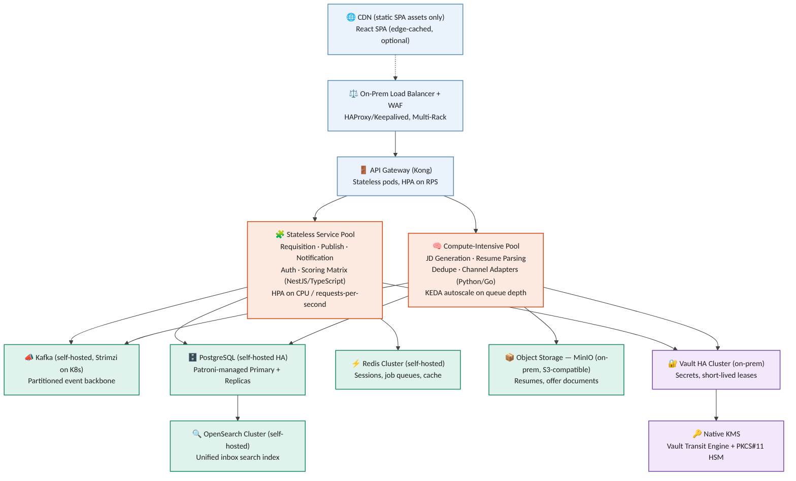{ style="max-width:100%" }

*Figure 18.1 — On-prem deployment topology: edge, API Gateway, the two application node pools, and the self-hosted stateful/security layer*

### 18.1 Node Pools
| **Node Pool** | **Runs** | **Autoscaling Trigger** | **Rationale** |
|----|----|----|----|
| Stateless Service Pool | API Gateway, Requisition, Publish, Notification, Auth, Scoring Matrix | Horizontal Pod Autoscaler (HPA) on CPU utilization and requests-per-second | Latency-sensitive request/response traffic; scaling must react within seconds to a traffic spike |
| Compute-Intensive Pool | JD Generation, Resume Parsing, Dedupe, Channel Adapters | KEDA, scaled on Kafka/Redis queue depth per topic/queue | Bursty, queue-fed background work — a resume-upload spike should not compete with the login path for the same pods |

On-prem HPA/KEDA still add pods within existing node capacity exactly as they would in the cloud; the difference is cluster autoscaling — adding a brand-new physical or virtual node is not an on-demand cloud API call here, it is pre-provisioned capacity. Both pools are therefore sized with explicit headroom above the BRD/PRD's reference load (Section 5, BRD/PRD Acceptance Criteria), not sized to the load itself, and capacity planning is revisited on a fixed schedule rather than left to autoscaling alone.

### 18.2 On-Prem Data Centre & Disaster Recovery
- Every stateful component (PostgreSQL, Redis, Kafka, OpenSearch, Vault) runs Multi-Rack within the primary data centre — spread across separate racks, power feeds, and top-of-rack switches with automated failover — so a single rack, PDU, or switch failure does not take the platform down.

- PostgreSQL: one primary plus at least two read replicas (Patroni-managed, Section 17.2), placed on separate racks; automated failover promotes a replica within the RTO target stated in the BRD/PRD's Acceptance Criteria (Section 5, BRD/PRD).

- Backups: continuous WAL archiving plus daily full snapshots, written to on-prem storage separate from the primary array, retained per tenant-configurable policy, satisfying the RPO target in the same Acceptance Criteria table.

- Object storage (resumes, offer documents, MinIO) is versioned with erasure-coded local replication across nodes; deletion is soft (tombstoned) before any hard-delete retention-policy job runs, so a mistaken delete is always recoverable within the retention window.

- Full-DR posture — a secondary data centre with cross-DC replication for every stateful component — is a fast-follow, not a Release 1 commitment; Release 1 ships with the single-DC, multi-rack redundancy above. Confirming the secondary-DC timeline and target RTO/RPO for that phase is an open dependency (Section 16).

- Infrastructure is defined as code (Terraform, with its VMware/bare-metal providers as applicable) so the cluster and its surrounding network/storage configuration can be reprovisioned from source rather than hand-built during an incident.

## 19. CI/CD Pipeline
Every service in Section 17 ships through the same pipeline shape, parameterized per service rather than forked per service — one pipeline definition, one place to fix a broken gate. The pipeline enforces that nothing reaches production without passing through staging, an automated test suite, and an explicit human approval; a canary step limits the blast radius of anything the earlier gates missed.

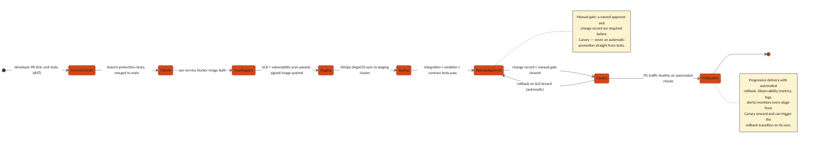{ style="max-width:100%" }

*Figure 19.1 — CI/CD pipeline: commit through canary to full production rollout, with automated SLO-triggered rollback*

### 19.1 Pipeline Stages
| **Stage** | **What Happens** | **Gate to Proceed** |
|----|----|----|
| Commit & PR Checks | Lint, unit tests, and static application security testing (SAST) run on every pull request | Branch protection requires these to pass plus a required human code review before merge |
| CI Build | On merge to main, a per-service Docker image is built (only the changed service's image, not a monolithic rebuild) | Build must succeed; image is tagged with the commit SHA, never "latest" |
| Scan & Registry | Software composition analysis (SCA) and container vulnerability scanning run against the built image | No critical/high vulnerability may pass; the image is then signed and pushed to an immutable container registry |
| Deploy to Staging | GitOps (ArgoCD) detects the new image tag and syncs the staging cluster's manifest to match | Sync must reach Healthy status in ArgoCD before the next stage starts |
| Automated Test Suite | Integration tests, the standing cross-tenant/cross-client isolation test suite (BRD/PRD Section 5), and contract tests against dependent services all run against staging | 100% of this suite must pass — no override |
| Release Approval | A named approver reviews the change record (what changed, test results, rollback plan) | Manual gate — a human decision is required; nothing promotes automatically from tests to production |
| Canary Deploy (Production) | The new version receives 5% of production traffic behind the same API Gateway | Automated health checks (error rate, latency, business-metric SLOs) must stay within threshold for a fixed observation window |
| Full Rollout + Observability | Traffic shifts progressively to 100% once the canary window passes clean | Continuous observability (metrics, logs, alerts) watches every stage from canary onward and can trigger the automatic rollback transition on its own, without waiting for a human to notice |

### 19.2 Environment Promotion
A change moves Dev → Staging → Canary (Production) → Full Production in that fixed order; no service-specific shortcut skips staging or canary, including for a hotfix — the pipeline is the fastest safe path, not an obstacle to route around under pressure.

- Infrastructure as Code (Terraform) provisions every environment from the same source, so Staging is a true architectural mirror of Production, not an approximation.

- Feature flags decouple code deployment from feature activation where a change needs to reach production before it is turned on for any tenant.

- Rollback is a redeploy of the last known-good image tag via the same GitOps path, never a manual server-side patch — the audit trail (Section 4.2) captures every promotion and rollback with requester identity and timestamp.
